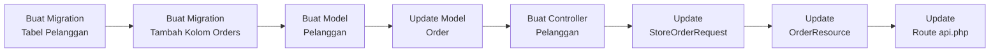
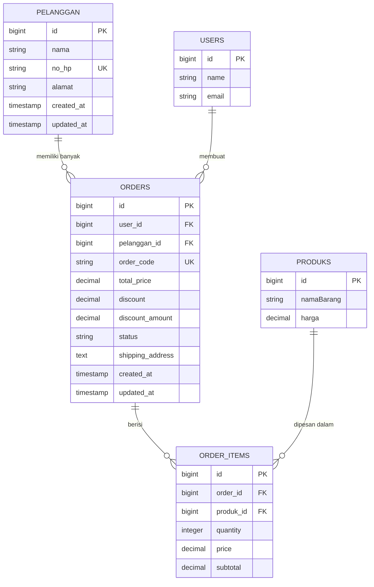

# Laporan Praktikum — Pembuatan Riwayat Pesanan (Backend)

> **Mata Kuliah:** Pemrograman Web  
> **Topik:** Pembuatan Fitur Riwayat Pesanan dengan Data Pelanggan & Diskon  
> **Framework:** Laravel 11  
> **Tanggal:** 26 Mei 2026

---

## Daftar Isi

1. [Pendahuluan](#1-pendahuluan)
2. [Membuat Tabel Pelanggan](#2-membuat-tabel-pelanggan)
3. [Menambahkan Kolom Customer & Discount pada Tabel Orders](#3-menambahkan-kolom-customer--discount-pada-tabel-orders)
4. [Membuat dan Memodifikasi Model Pelanggan](#4-membuat-dan-memodifikasi-model-pelanggan)
5. [Update Model Order](#5-update-model-order)
6. [Membuat Pelanggan Controller](#6-membuat-pelanggan-controller)
7. [Update StoreOrderRequest](#7-update-storeorderrequest)
8. [Update OrderResource](#8-update-orderresource)
9. [Update Route api.php](#9-update-route-apiphp)

---

## 1. Pendahuluan

Pada praktikum ini, kita akan membangun fitur **Riwayat Pesanan** pada backend Laravel API. Fitur ini bertujuan untuk:

- **Mengelola data pelanggan** — menyimpan informasi pelanggan seperti nama, nomor HP, dan alamat ke dalam database.
- **Mengintegrasikan pelanggan ke dalam sistem order** — setiap pesanan (order) dapat dikaitkan dengan seorang pelanggan, sehingga riwayat pembelian pelanggan bisa dilacak.
- **Menerapkan sistem diskon** — pelanggan yang terdaftar sebagai member otomatis mendapatkan diskon sebesar 5% pada setiap transaksi.
- **Menyediakan endpoint API** — membangun RESTful API endpoint untuk operasi CRUD pelanggan serta mengintegrasikan data pelanggan dan diskon ke dalam resource order yang sudah ada.

### Alur Kerja Praktikum



### Prasyarat

Sebelum memulai praktikum ini, pastikan:
- Laravel API project sudah berjalan dan terkoneksi ke database
- Tabel `orders` dan `order_items` sudah ada dari praktikum sebelumnya
- Autentikasi menggunakan **Laravel Sanctum** sudah dikonfigurasi

---

## 2. Membuat Tabel Pelanggan

### 2.1 Menjalankan Perintah Artisan

Jalankan perintah berikut di terminal untuk membuat file migration baru:

```bash
php artisan make:migration create_pelanggan_table
```

> [!NOTE]
> Perintah ini akan menghasilkan file migration baru di folder `database/migrations/` dengan nama yang diawali timestamp, contoh: `2026_05_16_014137_create_pelanggan_table.php`

### 2.2 Modifikasi Migration

Buka file migration yang baru dibuat, kemudian modifikasi menjadi seperti berikut:

**File:** `database/migrations/2026_05_16_014137_create_pelanggan_table.php`

```php
<?php

use Illuminate\Database\Migrations\Migration;
use Illuminate\Database\Schema\Blueprint;
use Illuminate\Support\Facades\Schema;

return new class extends Migration
{
    /**
     * Run the migrations.
     */
    public function up(): void
    {
        Schema::create('pelanggan', function (Blueprint $table) {
            $table->id();
            $table->string('nama');
            $table->string('no_hp')->unique();
            $table->string('alamat')->nullable();
            $table->timestamps();
        });
    }

    /**
     * Reverse the migrations.
     */
    public function down(): void
    {
        Schema::dropIfExists('pelanggan');
    }
};
```

### Penjelasan Kolom

| Kolom | Tipe | Keterangan |
|-------|------|------------|
| `id` | Big Integer (Auto Increment) | Primary key |
| `nama` | String | Nama lengkap pelanggan |
| `no_hp` | String (Unique) | Nomor HP pelanggan, dijadikan unik agar tidak ada duplikasi |
| `alamat` | String (Nullable) | Alamat pelanggan, bersifat opsional |
| `timestamps` | Timestamp | `created_at` dan `updated_at` otomatis dari Laravel |

---

## 3. Menambahkan Kolom Customer & Discount pada Tabel Orders

### 3.1 Menjalankan Perintah Artisan

Karena tabel `orders` sudah ada dari praktikum sebelumnya, kita membuat migration baru untuk **menambahkan kolom** ke tabel yang sudah ada:

```bash
php artisan make:migration add_customer_discount_to_orders_table
```

> [!NOTE]
> Perintah ini menggunakan konvensi penamaan `add_..._to_..._table` yang menunjukkan bahwa kita menambahkan kolom baru ke tabel yang sudah ada, bukan membuat tabel baru.

### 3.2 Modifikasi Migration

**File:** `database/migrations/2026_05_16_014639_add_customer_discount_to_orders_table.php`

```php
<?php

use Illuminate\Database\Migrations\Migration;
use Illuminate\Database\Schema\Blueprint;
use Illuminate\Support\Facades\Schema;

return new class extends Migration
{
    /**
     * Run the migrations.
     */
    public function up(): void
    {
        Schema::table('orders', function (Blueprint $table) {
            $table->foreignId('pelanggan_id')->nullable()->constrained('pelanggan')->nullOnDelete();
            $table->decimal('discount', 5, 2)->default(0);  //persentase, misal 5.00
            $table->decimal('discount_amount', 15, 2)->default(0); //nominal diskon
        });
    }

    /**
     * Reverse the migrations.
     */
    public function down(): void
    {
        Schema::table('orders', function (Blueprint $table) {
            //
        });
    }
};
```

### Penjelasan Kolom Baru

| Kolom | Tipe | Keterangan |
|-------|------|------------|
| `pelanggan_id` | Foreign Key (Nullable) | Menghubungkan order ke tabel `pelanggan`. Nullable karena order bisa dibuat tanpa pelanggan terdaftar. Menggunakan `nullOnDelete()` agar jika pelanggan dihapus, kolom ini di-set null (bukan ikut terhapus). |
| `discount` | Decimal(5,2) | Persentase diskon (contoh: `5.00` berarti 5%). Default `0`. |
| `discount_amount` | Decimal(15,2) | Nominal diskon dalam rupiah. Default `0`. |

> [!IMPORTANT]
> Perhatikan perbedaan antara `Schema::create()` (membuat tabel baru) dan `Schema::table()` (memodifikasi tabel yang sudah ada). Pada langkah ini kita menggunakan `Schema::table()` karena tabel `orders` sudah ada.

### 3.3 Menjalankan Migration

Setelah kedua file migration siap, jalankan perintah:

```bash
php artisan migrate
```

Pastikan migration berhasil dijalankan tanpa error.

---

## 4. Membuat dan Memodifikasi Model Pelanggan

### 4.1 Membuat Model

Jalankan perintah berikut untuk membuat model:

```bash
php artisan make:model Pelanggan
```

### 4.2 Modifikasi Model

**File:** `app/Models/Pelanggan.php`

```php
<?php

namespace App\Models;

use Illuminate\Database\Eloquent\Model;

class Pelanggan extends Model
{
    protected $table = 'pelanggan';
    protected $fillable = [
        'nama',
        'no_hp',
        'alamat',
    ];

    public function orders()
    {
        return $this->hasMany(Order::class, 'pelanggan_id');
    }
}
```

### Penjelasan Kode

| Bagian | Penjelasan |
|--------|-----------|
| `protected $table = 'pelanggan'` | Menentukan nama tabel secara eksplisit. Ini diperlukan karena Laravel secara default akan mencari tabel `pelanggans` (menambah huruf "s"), sedangkan nama tabel kita adalah `pelanggan`. |
| `protected $fillable` | Daftar kolom yang diizinkan untuk mass assignment (`create()`, `update()`). |
| `orders()` | Relasi **One-to-Many** — satu pelanggan bisa memiliki banyak order. Foreign key yang digunakan adalah `pelanggan_id` pada tabel `orders`. |

> [!TIP]
> Relasi `hasMany` berarti: "Satu Pelanggan **memiliki banyak** Order". Ini adalah sisi *inverse* dari relasi `belongsTo` yang akan kita definisikan di Model Order.

---

## 5. Update Model Order

Selanjutnya, kita perlu memperbarui Model Order untuk menambahkan relasi ke pelanggan dan kolom-kolom baru ke `$fillable`.

**File:** `app/Models/Order.php`

```php
<?php
// app/Models/Order.php
namespace App\Models;

use Illuminate\Database\Eloquent\Model;

class Order extends Model
{
    protected $fillable = [
        'user_id',
        // tambah pelanggan (praktikum 11)
        'pelanggan_id',
        'order_code',
        'total_price',
        // tambah diskon (praktikum 11)
        'discount',
        'discount_amount',
        'status',
        'shipping_address',
    ];

    public function user()
    {
        return $this->belongsTo(User::class);
    }

    public function items()
    {
        return $this->hasMany(OrderItem::class, 'order_id');
    }

    // praktikum 11
    public function pelanggan()
    {
        return $this->belongsTo(Pelanggan::class, 'pelanggan_id');  
    }
}
```

### Perubahan yang Dilakukan

```diff
 protected $fillable = [
     'user_id',
+    // tambah pelanggan (praktikum 11)
+    'pelanggan_id',
     'order_code',
     'total_price',
+    // tambah diskon (praktikum 11)
+    'discount',
+    'discount_amount',
     'status',
     'shipping_address',
 ];

 // ... relasi user() dan items() tetap sama ...

+// praktikum 11
+public function pelanggan()
+{
+    return $this->belongsTo(Pelanggan::class, 'pelanggan_id');  
+}
```

### Penjelasan Perubahan

| Perubahan | Penjelasan |
|-----------|-----------|
| Menambah `pelanggan_id` ke `$fillable` | Agar kolom `pelanggan_id` bisa diisi saat membuat order baru. |
| Menambah `discount` & `discount_amount` ke `$fillable` | Agar kolom diskon bisa diisi saat membuat atau mengupdate order. |
| Menambah relasi `pelanggan()` | Relasi **Many-to-One** (belongsTo) — setiap order *milik* satu pelanggan. Ini adalah pasangan dari relasi `hasMany` di Model Pelanggan. |

---

## 6. Membuat Pelanggan Controller

### 6.1 Membuat Controller

```bash
php artisan make:controller Api/PelangganController
```

### 6.2 Modifikasi Controller

**File:** `app/Http/Controllers/Api/PelangganController.php`

```php
<?php
// app/Http/Controllers/Api/PelangganController.php
namespace App\Http\Controllers\Api;

use App\Http\Controllers\Controller;
use App\Models\Pelanggan;
use Illuminate\Http\Request;

class PelangganController extends Controller
{
    public function index()
    {
        $pelanggan = Pelanggan::latest()->get();
        return response()->json([
            'success' => true,
            'data' => $pelanggan
        ]);
    }

    public function findByPhone($no_hp)
    {
        $pelanggan = Pelanggan::where('no_hp', $no_hp)->first();

        if (!$pelanggan) {
            return response()->json([
                'success' => false,
                'message' => 'Pelanggan tidak ditemukan' ,
            ], 404);
        } 
        return response()->json([
            'success' => true,
            'data' => $pelanggan
        ]);
        
    }

    public function store(Request $request)
    {
        $request->validate([
            'nama' => 'required|string|max:255',
            'no_hp' => 'required|string|max:20|unique:pelanggan,no_hp',
            'alamat' => 'required|string|max:500',
        ]);

        $pelanggan = Pelanggan::create($request->only('nama', 'no_hp', 'alamat'));

        return response()->json([
            'success' => true,
            'data' => $pelanggan
        ], 201);
    }

    public function update(Request $request, $id)
    {
        $pelanggan = Pelanggan::findOrFail($id);

        $request->validate([
            'nama' => 'sometimes|string|max:255',
            'no_hp' => 'sometimes|string|max:20|unique:pelanggan,no_hp,' . $pelanggan->id,
            'alamat' => 'nullable|string|max:500',
        ]);

        $pelanggan->update($request->only('nama', 'no_hp', 'alamat'));

        return response()->json([
            'success' => true,
            'data' => $pelanggan
        ]);
    }

    public function destroy($id)
    {
        Pelanggan::findOrFail($id)->delete();

        return response()->json([
            'success' => true,
            'message' => 'Pelanggan berhasil dihapus'
        ]);
    }
}
```

### Penjelasan Method

| Method | HTTP | Endpoint | Fungsi |
|--------|------|----------|--------|
| `index()` | GET | `/api/pelanggan` | Mengambil semua data pelanggan, diurutkan dari yang terbaru. |
| `findByPhone($no_hp)` | GET | `/api/pelanggan/phone/{no_hp}` | Mencari pelanggan berdasarkan nomor HP. Mengembalikan 404 jika tidak ditemukan. |
| `store()` | POST | `/api/pelanggan` | Membuat pelanggan baru. Memvalidasi bahwa `nama`, `no_hp` (unik), dan `alamat` wajib diisi. |
| `update()` | PUT | `/api/pelanggan/{id}` | Mengupdate data pelanggan. Menggunakan rule `sometimes` agar hanya field yang dikirim yang divalidasi. Rule `unique` di-exclude untuk ID pelanggan yang sedang diupdate. |
| `destroy()` | DELETE | `/api/pelanggan/{id}` | Menghapus pelanggan berdasarkan ID. Menggunakan `findOrFail()` yang otomatis mengembalikan 404 jika tidak ditemukan. |

> [!TIP]
> Method `findByPhone()` berguna untuk fitur POS di frontend — kasir bisa mencari pelanggan dengan nomor HP untuk mengaitkan transaksi dengan pelanggan member.

---

## 7. Update StoreOrderRequest

Kita perlu menambahkan validasi untuk `pelanggan_id` pada Form Request yang digunakan saat membuat order.

**File:** `app/Http/Requests/StoreOrderRequest.php`

```php
<?php

namespace App\Http\Requests;

use Illuminate\Foundation\Http\FormRequest;

class StoreOrderRequest extends FormRequest
{
    /**
     * Determine if the user is authorized to make this request.
     */
    public function authorize(): bool
    {
        return true;
    }

    /**
     * Get the validation rules that apply to the request.
     *
     * @return array<string, \Illuminate\Contracts\Validation\ValidationRule|array<mixed>|string>
     */
    public function rules(): array
    {
        return [
            'user_id'           => 'required|exists:users,id',
            'shipping_address'  => 'required|string',
            // tambah pelanggan (praktikum 11)
            'pelanggan_id'      => 'nullable|exists:pelanggan,id',
            'items'             => 'required|array|min:1',
            'items.*.produk_id' => 'required|exists:produks,id',
            'items.*.quantity'  => 'required|integer|min:1',
        ];
    }

    public function message(): array
    {
        return [
            'user_id.exists'            => 'User tidak ditemukan',
            'items.required'            => 'Keranjang belanja kosong',
            'items.*.produk_id.exists'  => 'Produk tidak ditemukan',
            'items.*.quantity.min'      => 'Jumlah produk harus minimal 1',
        ];
    }
}
```

### Perubahan yang Dilakukan

```diff
 public function rules(): array
 {
     return [
         'user_id'           => 'required|exists:users,id',
         'shipping_address'  => 'required|string',
+        // tambah pelanggan (praktikum 11)
+        'pelanggan_id'      => 'nullable|exists:pelanggan,id',
         'items'             => 'required|array|min:1',
         'items.*.produk_id' => 'required|exists:produks,id',
         'items.*.quantity'  => 'required|integer|min:1',
     ];
 }
```

### Penjelasan Rule Baru

| Rule | Penjelasan |
|------|-----------|
| `nullable` | Field `pelanggan_id` boleh tidak diisi (null). Ini karena tidak semua transaksi harus dikaitkan dengan pelanggan member. |
| `exists:pelanggan,id` | Jika diisi, nilainya harus merupakan `id` yang ada di tabel `pelanggan`. Ini mencegah pengiriman ID pelanggan yang tidak valid. |

---

## 8. Update OrderResource

OrderResource perlu diperbarui untuk menyertakan data pelanggan dan diskon pada response API.

**File:** `app/Http/Resources/OrderResource.php`

```php
<?php

namespace App\Http\Resources;

use Illuminate\Http\Request;
use Illuminate\Http\Resources\Json\JsonResource;

class OrderResource extends JsonResource
{
    /**
     * Transform the resource into an array.
     *
     * @return array<string, mixed>
     */
    public function toArray($request): array
    {
        return [
            'id' => $this->id,
            'order_code'        => $this->order_code,
            'status'            => $this->status,
            'shipping_address'  => $this->shipping_address,

            // praktikum 11 - tambah diskon 
            'discount'          => $this->discount,
            'discount_amount'   => $this->discount_amount,

            'total_price'       => $this->total_price,
            'created_at'        => $this->created_at->format('Y-m-d H:i:s'),

            'user' => [
                'id' => $this->user->id,
                'name' => $this->user->name,
                'email' => $this->user->email,
            ],

            // praktikum 11 - tambah pelanggan
            'pelanggan' => $this->pelanggan ? [
                'id' => $this->pelanggan->id,
                'nama' => $this->pelanggan->nama,
                'no_hp' => $this->pelanggan->no_hp,
                'alamat' => $this->pelanggan->alamat,
            ] : null,

            'items' => $this->items->map(function ($item) {
                return [
                    'produk_id'     => $item->produk->id,
                    'produk_name'   => $item->produk->namaBarang ?? null,
                    'price'         => $item->price,
                    'quantity'      => $item->quantity,
                    'subtotal'      => $item->subtotal,
                ];
            }),
        ];
    }
}
```

### Perubahan yang Dilakukan

```diff
 return [
     'id' => $this->id,
     'order_code'        => $this->order_code,
     'status'            => $this->status,
     'shipping_address'  => $this->shipping_address,

+    // praktikum 11 - tambah diskon 
+    'discount'          => $this->discount,
+    'discount_amount'   => $this->discount_amount,

     'total_price'       => $this->total_price,
     'created_at'        => $this->created_at->format('Y-m-d H:i:s'),

     'user' => [
         'id' => $this->user->id,
         'name' => $this->user->name,
         'email' => $this->user->email,
     ],

+    // praktikum 11 - tambah pelanggan
+    'pelanggan' => $this->pelanggan ? [
+        'id' => $this->pelanggan->id,
+        'nama' => $this->pelanggan->nama,
+        'no_hp' => $this->pelanggan->no_hp,
+        'alamat' => $this->pelanggan->alamat,
+    ] : null,

     'items' => $this->items->map(function ($item) {
         // ... tetap sama
     }),
 ];
```

### Penjelasan Perubahan

| Perubahan | Penjelasan |
|-----------|-----------|
| `discount` | Menampilkan persentase diskon yang diterapkan (contoh: `5.00`). |
| `discount_amount` | Menampilkan nominal diskon dalam rupiah. |
| `pelanggan` | Menampilkan data pelanggan yang terkait. Menggunakan **ternary operator** (`? :`) — jika pelanggan ada, tampilkan datanya; jika tidak (null), kembalikan `null`. |

---

## 9. Update Route api.php

Terakhir, kita perlu mendaftarkan endpoint pelanggan pada file route API.

**File:** `routes/api.php`

```php
<?php

use Illuminate\Support\Facades\Route;
use App\Http\Controllers\Api\UserApiController;
use App\Http\Controllers\Api\BukuApiController;
use App\Http\Controllers\Api\ProdukApiController;
use App\Http\Controllers\AuthController;
use App\Http\Controllers\Api\OrderApiController;
use App\Http\Controllers\Api\PelangganController;
use App\Http\Controllers\Api\PembelianController;
use App\Http\Controllers\Api\SupplierController;

use Illuminate\Http\Request;

Route::apiResource('users', UserApiController::class);
Route::apiResource('bukus', BukuApiController::class);
Route::apiResource('produks', ProdukApiController::class);
Route::post('/produks/{id}/images', [ProdukApiController::class, 'uploadImages']);
Route::apiResource('orders', OrderApiController::class);
Route::put('orders/{id}/status', [OrderApiController::class, 'updateStatus']);

Route::post('/register', [AuthController::class, 'register']);
Route::post('/login', [AuthController::class, 'login']);

Route::middleware('auth:sanctum')->group(function () {
    Route::get('/user', function (Request $request) {
        return $request->user(); 
    });

    Route::post('/logout', [AuthController::class, 'logout']); 

    // pelanggan
    Route::get('/pelanggan', [PelangganController::class, 'index']);
    Route::post('/pelanggan', [PelangganController::class, 'store']);
    Route::get('/pelanggan/phone/{no_hp}', [PelangganController::class, 'findByPhone']);
    Route::put('/pelanggan/{id}', [PelangganController::class, 'update']);
    Route::delete('/pelanggan/{id}', [PelangganController::class, 'destroy']);

    // ... route lainnya (supplier, pembelian)
});

Route::get('/', function () {
    return 'API is sukses';
});
```

### Perubahan yang Dilakukan

```diff
+   use App\Http\Controllers\Api\PelangganController;

 Route::middleware('auth:sanctum')->group(function () {
     

+    // pelanggan
+    Route::get('/pelanggan', [PelangganController::class, 'index']);
+    Route::post('/pelanggan', [PelangganController::class, 'store']);
+    Route::get('/pelanggan/phone/{no_hp}', [PelangganController::class, 'findByPhone']);
+    Route::put('/pelanggan/{id}', [PelangganController::class, 'update']);
+    Route::delete('/pelanggan/{id}', [PelangganController::class, 'destroy']);
 });
```

### Daftar Endpoint Pelanggan

| Method | Endpoint | Fungsi | Auth |
|--------|----------|--------|------|
| `GET` | `/api/pelanggan` | Daftar semua pelanggan | ✅ Sanctum |
| `POST` | `/api/pelanggan` | Tambah pelanggan baru | ✅ Sanctum |
| `GET` | `/api/pelanggan/phone/{no_hp}` | Cari pelanggan by no HP | ✅ Sanctum |
| `PUT` | `/api/pelanggan/{id}` | Update data pelanggan | ✅ Sanctum |
| `DELETE` | `/api/pelanggan/{id}` | Hapus pelanggan | ✅ Sanctum |

> [!IMPORTANT]
> Semua endpoint pelanggan ditempatkan di dalam middleware group `auth:sanctum`, artinya user harus login dan menyertakan token autentikasi pada header request untuk mengakses endpoint ini.

---

## Ringkasan Perubahan

### File Baru yang Dibuat

| No | File | Keterangan |
|----|------|-----------|
| 1 | `database/migrations/..._create_pelanggan_table.php` | Migration untuk tabel pelanggan |
| 2 | `database/migrations/..._add_customer_discount_to_orders_table.php` | Migration untuk menambah kolom di tabel orders |
| 3 | `app/Models/Pelanggan.php` | Model Pelanggan |
| 4 | `app/Http/Controllers/Api/PelangganController.php` | Controller CRUD Pelanggan |

### File yang Dimodifikasi

| No | File | Keterangan |
|----|------|-----------|
| 1 | `app/Models/Order.php` | Ditambah `pelanggan_id`, `discount`, `discount_amount` ke fillable dan relasi `pelanggan()` |
| 2 | `app/Http/Requests/StoreOrderRequest.php` | Ditambah rule validasi `pelanggan_id` |
| 3 | `app/Http/Resources/OrderResource.php` | Ditambah field `discount`, `discount_amount`, dan data `pelanggan` |
| 4 | `routes/api.php` | Ditambah 5 endpoint pelanggan dalam middleware sanctum |

### Diagram Relasi Database



---

> **Catatan:** Laporan ini mencakup bagian backend saja. Implementasi frontend (React) akan dibahas pada laporan selanjutnya.
